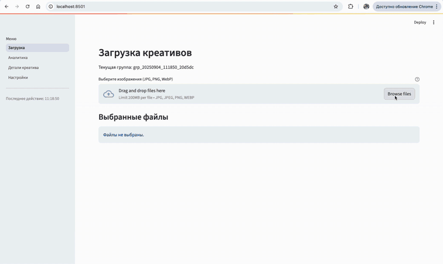
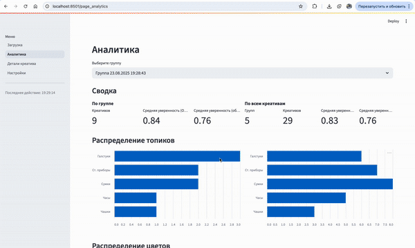
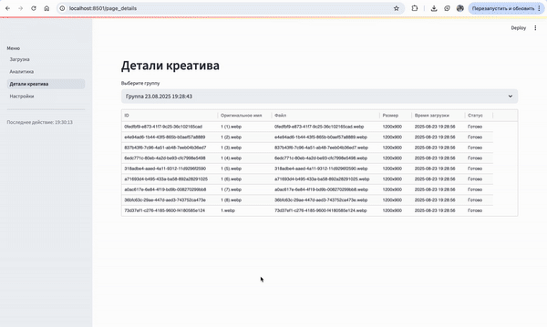
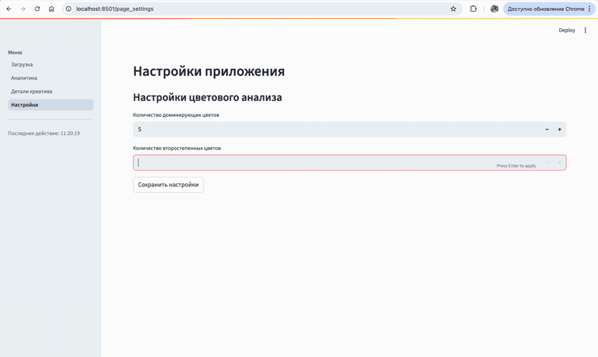

# MVP-сервис классификации рекламных креативов

Рекламные креативы — это «визитка» любого бренда. Аналитика креативов обычно делается вручную: маркетологи собирают баннеры, выделяют палитру цветов, анализируют слоганы. Процесс долгий и зависит от субъективного взгляда.

Наше решение

Мы разработали MVP-сервис, который берёт эту рутину на себя и делает аналитику креативов автоматической и объективной: - классифицирует баннеры по тематикам; - извлекает визуальные и текстовые признаки; - хранит данные централизованно в базе; - визуализирует аналитику по группам креативов.

Целевая аудитория

| Аудитория           | Польза                                                                 |
|---------------------|------------------------------------------------------------------------|
| Маркетологи     | Быстро понимают, какие темы и стили лидируют в креативах.              |
| Аналитики       | Получают централизованную базу для отчётов и исследований.             |
| Data Science    | Используют данные для обучения моделей и улучшения классификаторов.    |

---

## Возможности сервиса

Загрузка изображений
- Drag-and-drop или выбор файлов;
- Поддержка JPG, PNG, WebP;
- Индивидуальные и пакетные загрузки.



Аналитика группы креативов
- анализ цветовой палитры;
- выделение объектов на баннере;
- извлечение текста;
- классификация по тематикам.



Детальный просмотр креатива
- оригинальное изображение с размеченными объектами;
- палитра доминирующих цветов;
- текст с координатами.



Настройки:
- можно выбирать количество цветов 



---

## Структура проекта
```
ad_creatives_classification/
├── backend/                     # FastAPI + ML
│   ├── main.py                  # Точка входа
│   ├── api/                     # Роуты: upload, status, analytics...
│   ├── core/                    # Ядро инициализации
│   ├── services/                # Бизнес-логика
│   ├── ml_models/               # Загрузка и инференс моделей
│   ├── utils/                   # Вспомогательные функции
│   ├── database_models/         # ORM-модели
│   ├── models.py                # Pydentic модели
│   ├── database.py              # Работа с БД
│   ├── minio_client.py          # Работа с MinIO
│   ├── celery_worker.py         # Работа с Celery
│   ├── tasks.py                 # Celery-задачи
│   ├── config.py                
│   ├── Dockerfile                
│   └── requirements.txt
│
├── frontend/                    # Streamlit UI
│   ├── app.py                   # Главный файл
│   ├── pages/                   # Страницы: загрузка, аналитика, детали, настройки
│   ├── components/              # UI-компоненты (графики, цвета)
│   ├── services/                # API-клиенты
│   ├── utils/                   # Вспомогательные функции
│   ├── config.py                
│   ├── Dockerfile                
│   └── requirements.txt
│
├── minio_init/                  # Инициализация MinIO
│   ├── models/                  # ML-модели (веса)
│   ├── init.sh                  # Скрипт для dev-окружения
│   └── init-script.sh           # Скрипт для контейнера
├── docker-compose.yml           # Оркестрация сервисов
├── .env.example                 # Пример переменных окружения
└── README.md
```

---

# Запуск

## Требования

*   Docker & Docker Compose
*   Доступ к портам, указанным в `docker-compose.yml` (по умолчанию: 8000 - backend, 8501 - frontend, 5432 - db, 6379 - redis, 9000/9001 - minio)

## Установка

```shell
git clone https://github.com/OrlovAlexandr/ad_creatives_classification_mvp.git
cd ad_creatives_classification_mvp
cp .env.example .env
docker-compose up -d --build
```
Веса модели и тестовый набор данных можно [скачать здесь](https://disk.yandex.ru/d/wUhvyDwGhma_mQ). Веса необходимо положить в папку minio_init и выполнить команду 
```shell
unzip models.zip 
```

Дождитесь запуска всех сервисов. Проверить статус можно командой `docker-compose ps`.

Приложение будет доступно:
*   **Frontend (Streamlit UI):** `http://localhost:8501`
*   **Backend (FastAPI API):** `http://localhost:8000`
*   **MinIO:** `http://localhost:9001`

## Остановка

```bash
docker-compose down
```

## Настройки приложения

* Настройки, которые можно изменить через пользовательский интерфейс пока ограничены только выбором количества доминирующих и второстепенных цветов. 

*   **Настройку палитры цветов** можно изменить в `backend/config.py` в списках `PALETTE_HEX`, `MONOCHROME_HEX_SET`, `COLOR_CLASSES`, `COLOR_VISUAL_CLASSES`.
*   **Количество воркеров Celery:** Количество одновременно обрабатываемых задач регулируется параметром `CELERY_CONCURRENCY` в файле `.env`. После изменения этого параметра необходимо перезапустить сервис `celery_worker`:
    ```bash
    docker-compose restart celery_worker
    ```
    либо ввести команду, указав число в качестве значения.
    ```bash 
    CELERY_CONCURRENCY=2 docker-compose up -d celery_worker
    ```

## Мониторинг и логи

*   **Логи сервисов:** Используйте `docker-compose logs <имя_сервиса>` (например, `docker-compose logs backend`, `docker-compose logs celery_worker`) для просмотра логов конкретного сервиса.
*   **Celery Worker:** Статус выполнения задач обработки креативов можно отследить в логах сервиса `celery_worker`.


---
## Используемые технологии и архитектура  

### Фронтенд
*   Фронтенд реализован на **Streamlit**:
    * page_upload – загрузка креативов и отображение статуса обработки  
    * page_analytics – аналитика по группам и всем креативам  
    * page_details – детали одного креатива с визуализацией
    * page_settings – настройки

### Бэкенд
* Бэкенд работает на FastAPI и предоставляет REST API для обработки (`upload`, status, creatives, `analytics`).
* Для асинхронной обработки и параллельных вычислений используется Redis + Celery.  

### База данных и хранилище

*   **PostgreSQL:** Данные о креативах, группах и результатах анализа хранятся в PostgreSQL. Данные сохраняются в именованный том `postgres_data`, что обеспечивает их сохранность при перезапуске контейнеров.
*   **MinIO:** Загруженные изображения хранятся в объектном хранилище MinIO. Данные сохраняются в именованный том `minio_data`.

### Модели машинного обучения
* YOLOv8 — детекция объектов  
* EasyOCR — распознавание текста  
* BERT — анализ текста и тематики. Мультимодальный подход: текст + объекты объединяются в единый вектор для классификации  
* KMeans (scikit-learn) — анализ цветовой палитры  

Модели загружаются при запуске сервисов `backend` и `celery_worker`. Произведите холодный запуск одного креатива, чтобы загрузить модели.

Пути к кэшированным моделям определяются переменными `MODEL_CACHE_DIR` и `MODEL_MINIO_BUCKET` в `.env` и томом `model_cache`.

Если модели отсутствуют локально, они копируются из бакета MinIO, указанного в `MODEL_MINIO_BUCKET`. Убедитесь, что модели находятся в этом бакете на момент первого запуска.

### Визуализация
Визуализация выполнена с помощью Plotly и Streamlit:  
* сводная аналитика по группам и всем креативам  
* столбчатые диаграммы по тематикам  
* круговые диаграммы по цветам  
* топ-5 цветов по каждой тематике (stacked bar)  
* таблицы уверенности и времени обработки  

### Архитектура системы:  
```
Streamlit(ui) <-> FastAPI -> MinIO -> Redis (Celery)
                         \           /
                          PostgreSQL
```


### Как работает система:  
1. Пользователь загружает изображения, они сохраняются во временный каталог и загружаются в MinIO.  
2. В PostgreSQL создаётся запись о креативе.  
3. Celery запускает задачу: скачивает данные из MinIO, прогоняет через ML-модели (OCR, YOLO, BERT, KMeans) и сохраняет результаты в базу данных.  
4. Пользователь через фронтенд получает аналитику: детали одного креатива и сводную статистику по всем данным. 

---

# **API (FastAPI)**

API построен с использованием FastAPI и предоставляет следующие эндпоинты. Документация по API доступна в интерактивном виде по адресу backend-сервиса `http://localhost:8000/docs`.

### Группы (`/groups`)

*   `GET /groups`
    *   Получить список всех групп креативов.
    *   **Ответ:** `200 OK`
        ```json
        [
          {
            "group_id": "grp_20250826_123456_abc123",
            "display_name": "Группа 26.08.2025 12:34:56",
            "created_at": "2025-08-26T12:34:56.789012"
          },
          ...
        ]
        ```

### Загрузка (`/upload`)

*   `POST /upload`
    *   Загрузить файлы креативов в указанную группу. Обработка запускается асинхронно через Celery.
    *   **Запрос:**
        *   `files`: Список файлов.
        *   `group_id`: ID группы.
        *   `creative_ids`: Список ID для создаваемых креативов.
        *   `original_filenames`: Список оригинальных имен файлов.
    *   **Ответ:** `200 OK`
        ```json
        {
          "uploaded": 5, // Количество успешно загруженных файлов
          "group_id": "grp_20250826_123456_abc123",
          "errors": [], // Список ошибок
        }
        ```

### Креативы (`/creatives/{creative_id}`)

*   `GET /creatives/{creative_id}`
    *   Получить детальную информацию о креативе и результатах его анализа.
    *   **Ответ:** `200 OK`
        ```json
        {
          "creative_id": "<creative_id>",
          "group_id": "grp_20250826_123456_abc123",
          "original_filename": "image.jpg",
          "file_path": "http://localhost:9000/creatives/<creative_id>.webp", // Публичный URL
          "file_size": 123456,
          "file_format": "jpg",
          "image_width": 800,
          "image_height": 600,
          "upload_timestamp": "2025-08-26T12:35:00.123456",
          // Поля анализа (заполняются при overall_status == "SUCCESS")
          "overall_status": "SUCCESS", // "PENDING", "PROCESSING", "ERROR"
          "ocr_text": "Текст изображения",
          "ocr_blocks": [ /* блоки OCR с координатами*/ ],
          "detected_objects": [ /* объекты с классами и уверенностью */ ],
          "main_topic": "Часы",
          "topic_confidence": 0.98,
          "dominant_colors": [ /* доминирующие цвета */ ],
          "secondary_colors": [ /* второстепенные цвета */ ],
          "palette_colors": { /* цвета палитры */ }
        }
        ```
    *   **Ответ (не найден):** `404 Not Found`
    *   **Ответ (ошибка анализа):** `500 Internal Server Error`

### Креативы по группе (`/groups/{group_id}/creatives`)

*   `GET /groups/{group_id}/creatives`
    *   Получить список креативов в указанной группе с информацией о статусе анализа.
    *   **Ответ:** `200 OK`
        ```json
        [
          {
            "creative_id": "<creative_id>",
            "original_filename": "image.jpg",
            "file_path": "creatives/445eb04c-8387-46b2-a982-059c0be510ab.jpg",
            "file_size": 123456,
            "file_format": "jpg",
            "image_width": 800,
            "image_height": 600,
            "upload_timestamp": "2025-08-26T12:35:00.123456",
            "analysis": true // анализ успешен
          },
          ...
        ]
        ```

### Статус обработки (`/status/{creative_id}`)

*   `GET /status/{creative_id}`
    *   Получить текущий статус обработки конкретного креатива.
    *   **Ответ:** `200 OK`
        ```json
        {
          "creative_id": "<creative_id>",
          "original_filename": "bag 37.webp",
          "file_size": "70478 байт",
          "image_size": "900x1200",
          "upload_timestamp": "2025-08-26T07:03:05.704439",
          "main_topic": "bags",
          "topic_confidence": 0.80,
          "ocr_status": "10.6 sec",
          "detection_status": "6.4 sec",
          "classification_status": "5.7 sec",
          "color_status": "1.3 sec",
          "overall_status": "23.9 sec"
        }
        ```

### Аналитика (`/analytics`)

*   `GET /analytics/group/{group_id}`
    *   Получить аналитику по группе.
    *   **Ответ:** `200 OK`
        ```json
        {
          "summary": {
            "total_creatives": 6,
            "avg_ocr_confidence": 0.83,
            "avg_object_confidence": 0.59,
            "avg_topic_confidence": 0.78
          },
          "topics": [ /* список топиков с количеством в группе */ ],
          "dominant_colors": [ /* доминирующие цвета с количеством */ ],
          "durations": null,
          "topics_table": [ /* таблица топиков с количеством и средней уверенностью */ ],
          "total_processing_time": 45.8,
          "total_creatives_in_group": 6,
          "color_class_distribution": { /* распределение цветов (цвет: сумма процентов) */ },
          "topic_color_distribution": { /* распределение цветов по каждому топику (цвет, hex, процент) */ }
        }
        ```
    *   **Ответ (не найден):** `404 Not Found`

*   `GET /analytics/all`
    *   Получить сводную аналитику по всем группам.
    *   **Ответ:** `200 OK`
        ```json
        {
          // Структура аналогична /analytics/group/{group_id},
          // но содержит агрегированные данные по всем группам
          ...
          "total_processing_time": 123.45,
          "total_creatives_in_group": 100,
          ...
        }
        ```
    * **Ответ (не найден):** `404 Not Found`

### Настройки (`/settings`)

*   `GET /settings/`
    *   Получить все настройки приложения.
    *   **Ответ:** `200 OK`
        ```json
        {
          "DOMINANT_COLORS_COUNT": 3,
          "SECONDARY_COLORS_COUNT": 3
        }
        ```

*   `GET /settings/{key}`
    *   Получить значение конкретной настройки.
    *   `key`: Ключ настройки (напр, `DOMINANT_COLORS_COUNT`).
    *   **Ответ (успешный):** `200 OK`
        ```json
        {
        "key": "DOMINANT_COLORS_COUNT",
        "value": 3,
        "description": "Количество доминирующих цветов"
        }
        ```
    *   **Ответ (не найден):** `404 Not Found`

*   **`PUT /settings/{key}`**
    *   **Описание:** Обновить значение конкретной настройки.
    *   **Параметры пути:**
        *   `key`: Ключ настройки.
        *   `value`: Новое значение настройки.


*   **`PUT /settings/`**
    *   **Описание:** Обновить несколько настроек одновременно.
    *   **Запрос:**
        ```json
        {
          "DOMINANT_COLORS_COUNT": 5,
          "SECONDARY_COLORS_COUNT": 4
        }
        ```
    *   **Ответ:** `200 OK`
        ```json
        {
          "DOMINANT_COLORS_COUNT": 5,
          "SECONDARY_COLORS_COUNT": 4
        }
        ```
---

# Запуск тестов

Проект включает в себя автоматизированные тесты для обеспечения качества кода и корректности работы функций. Тесты разделены на **юнит-тесты** и **интеграционные тесты** (взаимодействие API).

### Требования для запуска тестов

*   Docker & Docker Compose (тесты запускаются внутри контейнеров для обеспечения  воспроизводимости).
*   Зависимости, указанные в `backend/requirements-test.txt` устанавливаются при сборке Docker-образа.

### Запуск тестов через Docker Compose

Этот способ использует сервис, определенный в `docker-compose.yml`, и гарантирует, что тесты выполняются в той же среде, что и остальное приложение.

1.  Запуск всех тестов:
     `docker-compose run` для запуска тестов в отдельном контейнере.
    ```bash
    docker-compose run --rm backend pytest
    ```

2.  **Запуск тестов определенного типа:**
    *   **Только юнит-тесты:**
        ```bash
        docker-compose run --rm backend pytest tests/unit
        ```
    *   **Только интеграционные тесты API:**
        ```bash
        docker-compose run --rm backend pytest tests/integration
        ```

3.  **Запуск конкретного файла или теста:**
    ```bash
    docker-compose run --rm backend pytest tests/integration/test_api_endpoints.py
    ```
    
    ```bash
    docker-compose run --rm backend pytest tests/integration/test_api_endpoints.py::test_get_groups_empty
    ```

4.  **Запуск тестов с дополнительными опциями:**
    Вы можете передавать стандартные аргументы командной строки `pytest`:
    ```bash
    # Запуск с подробным выводом (-v)
    docker-compose run --rm backend pytest -v

    # Запуск с остановкой при первой ошибке (-x)
    docker-compose run --rm backend pytest -x

    # Запуск с выводом print() (-s)
    docker-compose run --rm backend pytest -s

    # Запуск с покрытием кода
    docker-compose run --rm backend pytest --cov=.
    ```

### Стиль кода и линтеры

Для поддержания единообразия в коде и выявления потенциальных проблем используется линтер `ruff`. Вы можете запускать его локально в своей среде разработки.

**Для локального запуска `ruff`:**

1.  **Убедитесь, что вы используете правильное виртуальное окружение:**
    Команды ниже предполагают, что вы работаете в виртуальном окружении вашего проекта (например, `.venv`), где установлены все зависимости, включая `ruff`.

    ```bash
    # Linux/macOS
    source .venv/bin/activate
    # Windows
    .venv\Scripts\activate
    ```

2.  **(Если `ruff` еще не установлен локально):**
    Установите `ruff`, используя зависимости из файла `requirements-test.txt`:
    ```bash
    pip install -r backend/requirements-test.txt
    ```
    Это установит `ruff` (и другие инструменты для тестирования) в ваше локальное виртуальное окружение.

3.  **Запуск проверки стиля:**
    Из **корневой директории проекта** (где находится файл `pyproject.toml`, содержащий настройки `ruff`) выполните:
    ```bash
    # Проверка всего проекта
    ruff check .

    # или
    python -m ruff check .
    ```

4.  **Автоматическое исправление простых ошибок:**
    `ruff` может автоматически исправить многие найденные проблемы:
    ```bash
    ruff check . --fix
    ```

Настройки `ruff`  определяются в файле `pyproject.toml` в корне проекта. Убедитесь, что этот файл существует.
Запускайте `ruff` из корневой директории проекта, чтобы он мог найти конфигурационный файл.

