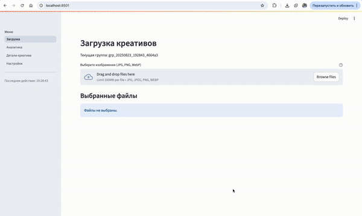

# MVP-сервис классификации рекламных креативов

Рекламные креативы — это «визитка» любого бренда. Аналитика креативов обычно делается вручную: маркетологи собирают баннеры, выделяют палитру цветов, анализируют слоганы. Процесс долгий и зависит от субъективного взгляда.

**Наше решение**

Мы разработали MVP-сервис, который берёт эту рутину на себя и делает аналитику креативов автоматической и объективной: - классифицирует баннеры по тематикам; - извлекает визуальные и текстовые признаки; - хранит данные централизованно в базе; - визуализирует аналитику по группам креативов.

**Целевая аудитория**

| Аудитория           | Польза                                                                 |
|---------------------|------------------------------------------------------------------------|
| Маркетологи     | Быстро понимают, какие темы и стили лидируют в креативах.              |
| Аналитики       | Получают централизованную базу для отчётов и исследований.             |
| Data Science    | Используют данные для обучения моделей и улучшения классификаторов.    |

---

## Возможности сервиса

**Загрузка изображений**
- Drag-and-drop или выбор файлов;
- Поддержка JPG, PNG, WebP;
- Индивидуальные и пакетные загрузки.


**Аналитика группы креативов**
- анализ цветовой палитры;
- выделение объектов на баннере;
- извлечение текста;
- классификация по тематикам.


**Детальный просмотр креатива**
- оригинальное изображение с размеченными объектами;
- палитра доминирующих цветов;
- текст с координатами.


---

# Запуск
```
git clone https://github.com/OrlovAlexandr/ad_creatives_classification_mvp.git
cd creatives-mvp
cp .env.example .env
docker-compose up --build
```
Веса модели можно [скачать здесь](https://disk.yandex.ru/d/wUhvyDwGhma_mQ).

---

# API
1. Загрузка креативов 
POST /upload 
2. Список групп креативов 
GET /groups 
3. Детали креатива 
GET /creatives/{creative_id} 
4. Креативы по группе 
GET /groups/{group_id}/creatives 
5. Статус обработки креатива 
GET /status/{creative_id} 
6. Аналитика группы 
GET /analytics/group/{group_id} 
7. Общая аналитика 
GET /analytics/all

